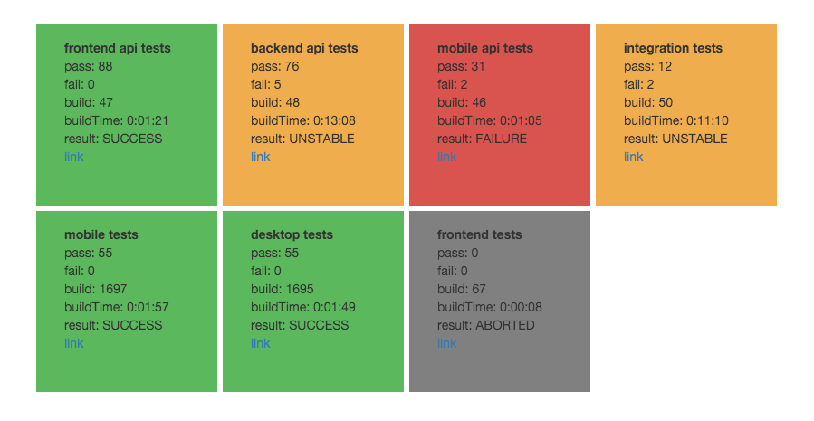

# dashi

Jenkins Dashboard to display test results in cards. frontend written in React, current backend written i python. tested with junit test reports.



install
-------
```bash
$ pip install -r requirements.txt
$ npm install -g bower
$ bower install
```

copy the example config to config.yaml and configure it to to one or multiple Jenkins. point to a redis host, if you like to run with docker-compose set the host to redis
```bash
$ cp example.config.yml config.yml
```

run from shell
you can access the webUI on http://\<host\>:3000
--------------
```bash
$ python server.py
```

docker build
------------
to build the container using the pre build base container use `make` for a full build container with `make fullbuild`
```bash
$ make
```

docker run
----------
start docker, stack contains redis and a haproxy
```bash
$ docker-compose up -d
```
